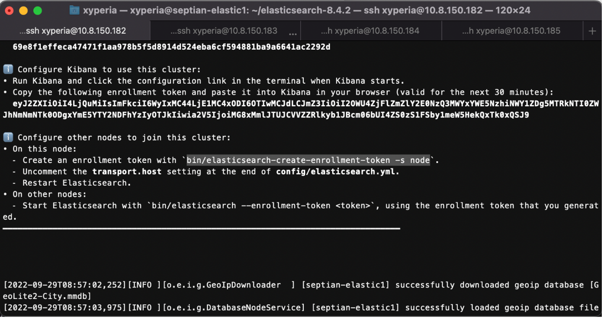

# Install Elasticsearch
---

Setelah Elasticsearch binary dimasukkan ke semua Elasticsearch nodes, silahkan ekstrak arsip Elasticsearch yang sudah diunduh dengan perintah ```tar -xvf [file tar]```

Setelah komponen Elasticsearch diekstrak, akan ada direktori seperti di gambar berikut.



Masuk ke dalam direktori tersebut dengan perintah ```cd [nama folder]```