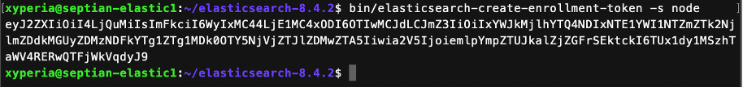

# Joining nodes
---

Agar tiap nodes dapat saling terhubung di dalam satu cluster, kita harus menambahkan hostname semua Elasticsearch nodes ke dalam file konfigurasi di tiap-tiap nodes.

Tambahkan atau aktifkan baris konfigurasi berikut
=== config/elasticsearch.yml
discovery.seed_hosts: ["septian-elastic1", "septian-elastic2", "septian-elastic3"]
cluster.initial_master_nodes: ["septian-elastic1", "septian-elastic2", "septian-elastic3"]
transport.host: 0.0.0.0
===

!!!info Info
septian-elastic1 diambil dari entry yang sudah ditambahkan sebelumnya di /etc/hosts
!!!

Setelah selesai menambahkan konfigurasi jalankan kembali Elasticsearch dengan perintah berikut:
```
bin/elasticsearch -d -p pid
```

Selanjutnya kita dapat menggunakan enrollment token untuk menambahkan node lain. Untuk membuat enrollment token, silahkan menjalankan perintah berikut:
```
bin/elasticsearch-create-enrollment-token -s node
```



Simpan token untuk setup nodes yang berikutnya.