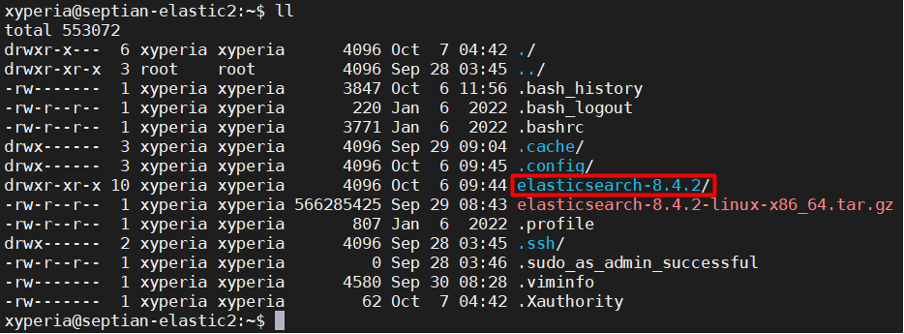

# Joining other nodes
---

Konfigurasi harus dilakukan juga di nodes lainnya. Silahkan ekstrak arsip Elasticsearch pada server lainnya dengan perintah:
```
tar -xvf [file tar]
```

Setelah komponen Elastic diekstrak akan ada direktori seperti di gambar. Masuk ke dalam direktori tersebut dengan perintah:
```
cd [nama folder]
```



selanjutnya jalankan perintah berikut:
```bin/elasticsearch –enrollment-token <token>```
!!!info Info
token diambil dari enrollment token yang dibuat dari node 1
!!!

Setelah muncul log seperti pada gambar berikut, silahkan hentikan proses dari Elasticsearch dengan perintah:
**CTRL+C**


Selanjutnya tambahkan atau aktifkan baris konfigurasi berikut:

=== config/elasticsearch.yml
discovery.seed_hosts: ["septian-elastic1", "septian-elastic2", "septian-elastic3"]
cluster.initial_master_nodes: ["septian-elastic1", "septian-elastic2", "septian-elastic3"]
transport.host: 0.0.0.0
===

Setelah selesai menambahkan konfigurasi jalankan kembali Elasticsearch dengan perintah:
```
bin/elasticsearch -d -p pid
```

Jalankan tahapan diatas untuk server berikutnya. Selanjutnya kita melakukan pengecekan node pada cluster apakah sudah join semua dengan mengakses url berikut:
```
https://[salah satu ip node]:9200/_cat/nodes?v
```

```
Username: elastic
Password: <generated password from node 1>
```


Jika proses join node cluster berhasil maka pada pengujian akan tampil seperti gambar berikut.

