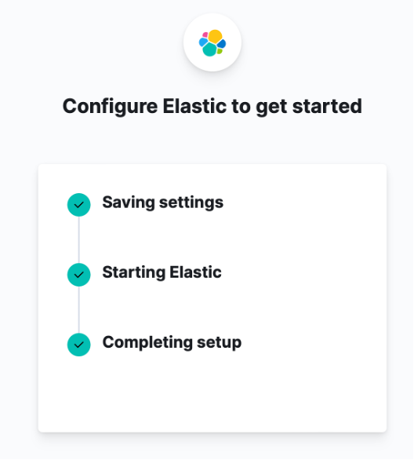

# Setup Kibana
---

Unduh Kibana binaries pada server yang akan di install dengan perintah:
```wget https://artifacts.elastic.co/downloads/kibana/kibana-8.4.2-linux-x86_64.tar.gz```
*\*Versi Kibana sewaktu-waktu dapat berubah. Untuk versi yang terupdate, silahkan kunjungi https://www.elastic.co/downloads/kibana*

Berikutnya Ekstrak arsip Kibana dengan perintah:
```
tar -xvf [file tar]
```

Selanjutnya ubah file konfigurasi kibana di **config/kibana.yml** dan tambahkan atau aktifkan baris berikut:
```server.host: "0.0.0.0"```

Selanjutnya jalankan Kibana menggunakan perintah berikut
```bin/kibana```


Setelah Kibana berhasil dijalankan. Silahkan akses url Kibana yang tertera pada log terminal (http://[ip kibana]:5601/?code=[kode]), setelah diakses, akan tampil pada browser seperti gambar berikut.


Selanjutnya jalankan perintah berikut menggunakan node 1 untuk mendapatkan token yang akan digunakan untuk setup Kibana.
```bin/elasticsearch-create-enrollment-token -s kibana```


Salin token yang berhasil digenerate, lalu tempelkan pada kotak dialog pada Kibana dan pilih Configure Elastic hingga tampil halaman verifikasi seperti gambar berikut.


Cek pada console server Kibana untuk mendapatkan kode verifikasi seperti pada gambar berikut.



Selanjutnya login Kibana menggunakan user dan password berikut:
```
Username: elastic
Password: <generated password from node 1>
```
