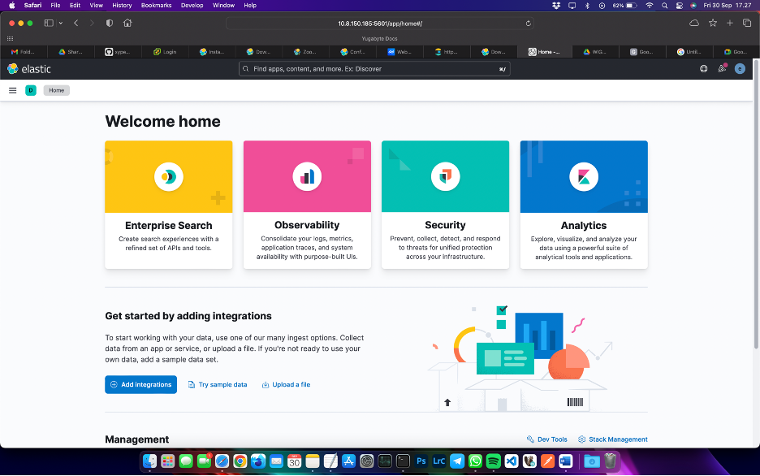
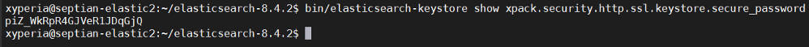

# Securing Kibana
---

Agar portal Kibana bisa diakses menggunakan port 443 (HTTPS), pada console node 1 pada folder [elastic home]/ jalankan perintah berikut:
```
bin/elasticsearch-keystore show xpack.security.http.ssl.keystore.secure_password
```

Kemudian jalankan perintah berikut untuk create crt dan key. Gunakan password sebelumnya untuk menjalankan perintah berikut.

```
openssl pkcs12 -in config/certs/http.p12 -clcerts -nokeys -out server-kibana.crt
openssl pkcs12 -in config/certs/http.p12 -nocerts -nodes -out server-kibana.key
```



Salin file **server-kibana.crt** dan **server-kibana.key** ke server kibana dengan perintah berikut.
```
scp [file] xyperia@[ip tujuan]:[path tujuan]
```

Selanjutnya ubah file konfigurasi Kibana di **config/kibana.yml** dan tambahkan atau aktifkan baris berikut:
```
xpack.security.encryptionKey: "something_at_least_32_characters"
xpack.encryptedSavedObjects.encryptionKey: "something_at_least_32_characters"
server.ssl.enabled: true
server.ssl.certificate: /home/xyperia/kibana-8.4.2/config/certs/server-kibana.crt
server.ssl.key: /home/xyperia/kibana-8.4.2/config/certs/server-kibana.key
```

Stop Kibana dengan menekan tombol **CTRL+C**, kemudian jalankan kembali Kibana menggunakan perintah.
```
bin/kibana &
```

Setelah Kibana berhasil jalan, pastikan kembali dengan mengakses Kibana menggunakan secure protocol (https://[ip kibana]:5601/).

